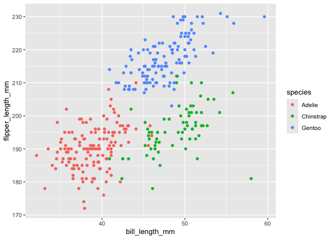

p8105_hw1_yc4959
================
Yimeng Cao
2026-09-20

This is an R markdown document for 8105 homework 1.

## Probelm 1

Load the penguins dataset

``` r
data("penguins", package = "palmerpenguins")
```

The penguins dataset contains some penguin information. Important
variables include species, island, bill length (mm), bill depth (mm),
flipper length (mm), body mass (g), sex and year. The size of dataset
has 344 rows and 8 columns. The mean flipper length is 200.9152047 mm.

Create scatter plot of flipper length vs bill length.

``` r
penguins %>%
  ggplot(aes(x = bill_length_mm, y = flipper_length_mm, color = species)) +
  geom_point()
```

    ## Warning: Removed 2 rows containing missing values or values outside the scale range
    ## (`geom_point()`).

<!-- --> Save
the plot

``` r
ggsave("penguin_plot.png")
```

    ## Saving 7 x 5 in image

    ## Warning: Removed 2 rows containing missing values or values outside the scale range
    ## (`geom_point()`).

## Problem 2

Create a data frame call data_frame： a random sample of size 10 from a
standard Normal distribution a logical vector indicating whether
elements of the sample are greater than 0 a character vector of length
10 a factor vector of length 10, with 3 different factor “levels”

``` r
data_frame = tibble(
  norm_samp = rnorm(10),
  vec_logical = norm_samp > 0,
  vec_character = c("y", "i", "m", "e", "n", "g", "1", "c", "a", "o"),
  vec_factor = factor(c("small", "small", "medium", "medium", "medium", "medium", "medium", "large", "large", "large"))
)
```

Try to take the mean of each variable in your data frame.

``` r
mean(pull(data_frame, norm_samp))
```

    ## [1] -0.4647681

``` r
mean(pull(data_frame, vec_logical))
```

    ## [1] 0.3

``` r
mean(pull(data_frame, vec_character))
```

    ## Warning in mean.default(pull(data_frame, vec_character)): argument is not
    ## numeric or logical: returning NA

    ## [1] NA

``` r
mean(pull(data_frame, vec_factor))
```

    ## Warning in mean.default(pull(data_frame, vec_factor)): argument is not numeric
    ## or logical: returning NA

    ## [1] NA

The numeric variable and logical vector can have means, but the
character and factor vectors cannot have means because they represent
text and categories.
